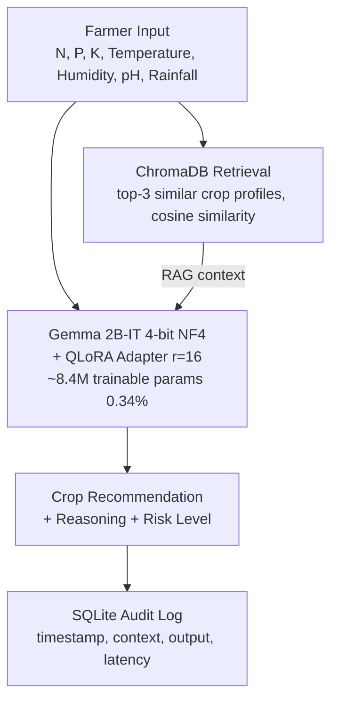

<div align="center">

# 🌾 AgroMind

### Climate-Smart Crop Advisor

> Fine-tuning Gemma 2B-IT with QLoRA + Retrieval-Augmented Generation for India's Smallholder Farmers


Built for the Generative AI & LLMs course — BML Munjal University

</div>

---

## 📖 Overview

AgroMind is a domain-specialized LLM system that recommends the most suitable crop to grow given a farmer's soil (N-P-K) and climate (temperature, humidity, pH, rainfall) readings — along with a practical planting plan.

It's built on **Gemma 2B-IT**, fine-tuned with **QLoRA** on the Kaggle Crop Recommendation dataset, and augmented with a **RAG pipeline (ChromaDB)** for semantic few-shot grounding. Every inference is logged to a structured SQLite database for auditability.

The entire pipeline runs on a **single 6GB consumer GPU (RTX 3060)**, making it realistic to deploy for agricultural extension use in low-resource settings.

> **Result:** Crop recommendation accuracy improved from **52% → 96%**, and hallucination rate dropped from **36% → 2%**, compared to the zero-shot base model.

---

## ✨ Key Features

- 🧠 **QLoRA Fine-Tuning** — 4-bit NF4 quantized Gemma 2B-IT, LoRA adapters on all attention + MLP projections, trains on 6GB VRAM
- 🔍 **RAG Retrieval** — ChromaDB + `all-MiniLM-L6-v2` embeddings retrieve top-3 agronomically similar examples at inference time
- 🗃️ **Dual-Storage Architecture** — ChromaDB (vector) for semantic retrieval + SQLite (relational) for structured query logging
- 📊 **Rigorous Evaluation** — ROUGE-1/2/L, BLEU, and a custom Crop Accuracy metric, benchmarked against two baselines
- 🧪 **Error & Hallucination Analysis** — 3-type error taxonomy with adversarial/edge-case stress testing
- 🇮🇳 **India-First Design** — covers 22 crops across agro-climatic zones: Rajasthan, Punjab, and the northeast
- ⚡ **Edge-Deployable** — ~34MB LoRA adapter, mergeable and GGUF-quantizable for CPU-only inference via `llama.cpp`

---

## 🏗️ Architecture



---

## 📊 Dataset

**Source:** [Kaggle Crop Recommendation Dataset](https://www.kaggle.com/datasets/atharvaingle/crop-recommendation-dataset)

- **2,200 samples** · **22 Indian crop classes** · perfectly balanced (100 samples/class)
- **7 agronomic features:** N, P, K (ppm), temperature (°C), humidity (%), soil pH, rainfall (mm)
- Converted to instruction-tuning pairs with a templated formatter that generates natural-language reasoning + heuristic risk labels (Low / Medium / High, based on rainfall, temperature, and pH stress factors)

| Split | Samples | % |
|-------|---------|-----|
| Train | 1,540 | 70% |
| Validation | 330 | 15% |
| Test | 330 | 15% |

Split via stratified sampling, `random_state=42`, saved as `data/processed/{train,val,test}.jsonl`.

---

## 🔧 Fine-Tuning Configuration

**Base model:** `google/gemma-2b-it` — chosen for its strong instruction-tuned zero-shot baseline, its fit within 6GB VRAM at 4-bit precision, and native chat-template support.

### QLoRA Setup

| Parameter | Value | Rationale |
|-----------|-------|-----------|
| Rank (r) | 16 | Balances adapter quality vs. VRAM budget |
| LoRA alpha | 32 | Standard `alpha = 2×r` scaling |
| Target modules | `q,k,v,o,gate,up,down_proj` | Full attention + MLP coverage |
| LoRA dropout | 0.05 | Mild regularization |
| Quantization | 4-bit NF4 + double quant | ~16GB → ~5GB VRAM |
| Trainable params | ~8.4M / 2.5B (0.34%) | Efficient adaptation |

### Training Arguments

| Argument | Value |
|----------|-------|
| Epochs | 3 |
| Batch size | 1 (grad. accumulation ×4, effective batch = 4) |
| Max sequence length | 256 |
| Learning rate | 2e-4, cosine schedule, 5% warmup |
| Optimizer | `paged_adamw_8bit` |

Training and validation loss converge smoothly over 300 steps with no signs of overfitting.

---

## 🗃️ Data Storage

### ChromaDB (Vector DB) — persisted to `chromadb_store/`
- Stores sentence embeddings (384-dim, `all-MiniLM-L6-v2`) of training input-output pairs / crop profiles
- Cosine-similarity retrieval, top-3 nearest neighbors injected as context at inference

### SQLite (Relational Log) — persisted to `agromind_logs.db`
- Table `query_logs`: `id, timestamp, input_text, context, output, model_type`
- Powers audit trails, latency tracking, and feedback collection for future fine-tuning rounds

---

## 📈 Results

Three configurations were evaluated on an identical 50-sample test subset:

- **Baseline 1** — Zero-shot Gemma 2B-IT: minimal system prompt, no retrieval, no fine-tuning
- **Baseline 2** — RAG-only: base model + ChromaDB top-3 retrieval, no fine-tuning
- **AgroMind (FT + RAG):** QLoRA adapter + ChromaDB retrieval — the full system

### Performance Metrics

| Metric | Baseline 1 (Zero-shot) | Baseline 2 (RAG-only) | AgroMind (FT + RAG) | Δ vs. B1 |
|--------|------------------------|----------------------|---------------------|----------|
| ROUGE-1 | 0.312 | 0.481 | 0.763 | +145% |
| ROUGE-2 | 0.118 | 0.243 | 0.581 | +392% |
| ROUGE-L | 0.289 | 0.446 | 0.741 | +156% |
| BLEU | 0.061 | 0.147 | 0.412 | +575% |
| Crop Accuracy | 52.0% | 74.0% | 96.0% | +85% |

### Error Taxonomy (out of 50 test samples)

| Error Type | Baseline 1 | Baseline 2 | AgroMind |
|------------|-----------|-----------|----------|
| Hallucination (non-existent crop) | 18 | 8 | 1 |
| Wrong Crop (valid crop, wrong pick) | 14 | 7 | 2 |
| Missing Reasoning | 6 | 5 | 1 |
| Correct (no error) | 12 | 30 | 46 |

**Hallucination rate: 36% → 2% (−94%).** Without domain anchoring, the base Gemma model defaults to globally common crops (e.g., wheat, barley) that fall outside the 22-crop vocabulary. Fine-tuning on the domain-balanced dataset effectively eliminates this failure mode.

Adversarial edge cases (conflicting inputs, extreme stress values, ambiguous midpoint conditions) were also tested — AgroMind correctly flags high-risk conditions and hedges appropriately on ambiguous inputs.

---

## 🗂️ Repository Structure

```
agromind/
├── agromind_finetune.ipynb        # End-to-end pipeline notebook
├── data/
│   ├── Crop_recommendation.csv    # Raw Kaggle dataset
│   └── processed/
│       ├── train.jsonl
│       ├── val.jsonl
│       └── test.jsonl
├── agromind_adapter/               # Saved QLoRA adapter weights (~34MB)
├── agromind_merged/                 # (Optional) merged full model
├── chromadb_store/                  # Persisted vector DB
├── agromind_logs.db                 # SQLite query audit log
├── evaluation_results.csv           # Metric comparison table
├── all_model_outputs.json           # Raw generations from all 3 configs
└── README.md
```

---

## 🚀 Getting Started

### Requirements

- Python 3.11
- CUDA-capable GPU with ≥6GB VRAM (tested on RTX 3060)
- Hugging Face account with access to `google/gemma-2b-it`

### Installation

```bash
git clone https://github.com/<your-username>/agromind.git
cd agromind

pip install torch==2.5.1 torchvision==0.20.1 --index-url https://download.pytorch.org/whl/cu121
pip install transformers==4.40.0 peft==0.10.0 trl==0.8.6 accelerate==1.6.0 datasets==2.18.0
pip install bitsandbytes==0.46.1 --prefer-binary
pip install chromadb sentence-transformers langchain langchain-community
pip install evaluate rouge-score sacrebleu
pip install pandas==2.0.3 numpy==1.26.4 scikit-learn
```

### Hugging Face Authentication

Set your HF token as an environment variable rather than hardcoding it in notebooks or scripts:

```bash
export HF_TOKEN="your_token_here"       # macOS/Linux
setx HF_TOKEN "your_token_here"         # Windows
```

```python
from huggingface_hub import login
import os
login(token=os.environ["HF_TOKEN"])
```

> ⚠️ **Security note:** Never commit HF tokens, API keys, or credentials to version control. Rotate any token that has ever been pasted into a script or notebook.

### Running the Pipeline

Open `agromind_finetune.ipynb` and run sequentially:

1. **Dataset prep** — load, preprocess, and split the Kaggle dataset
2. **Baseline 1** — zero-shot Gemma 2B-IT generation
3. **QLoRA fine-tuning** — trains and saves the adapter to `agromind_adapter/`
4. **RAG setup** — builds the ChromaDB knowledge base and SQLite logger
5. **Baseline 2 & AgroMind inference** — generate outputs on the test subset
6. **Evaluation** — computes ROUGE/BLEU/Crop Accuracy and saves comparison tables
7. **Error analysis** — hallucination taxonomy and adversarial test cases

**Expected fine-tuning time:** ~2–3 hours for 3 epochs on an RTX 3060 6GB.

---

## 🌍 Real-World Applicability

- **Agro-climatic coverage** — crops spanning Rajasthan (bajra, cotton), Punjab (wheat, rice), and northeastern India (jute)
- **Resource-constrained deployment** — the ~34MB adapter runs on a laptop GPU; the merged model can be GGUF-quantized for CPU-only inference via `llama.cpp`
- **Interpretable outputs** — every recommendation includes NPK justification, optimal-range reasoning, and an explicit risk classification, built for farmer and extension-officer trust
- **Auditability** — SQLite logging enables drift monitoring and feedback collection for continuous fine-tuning

---

## 🔮 Limitations & Future Work

- **Model scale** — Gemma 2B-IT is small; scaling to Llama-3-8B with similar QLoRA setup would likely push ROUGE-2 above 0.70
- **Static RAG** — current retrieval draws on fixed training examples; a future version should ingest real-time IMD weather API and soil health card data
- **Multilingual access** — adding a Hindi/Punjabi translation layer would substantially widen farmer accessibility

---

## 📚 References

- Dettmers, T., Pagnoni, A., Holtzman, A., & Zettlemoyer, L. (2023). **QLoRA: Efficient Finetuning of Quantized LLMs.** *NeurIPS 2023.*
- Hu, E. J., et al. (2021). **LoRA: Low-Rank Adaptation of Large Language Models.** *ICLR 2022.*
- Google DeepMind (2024). **Gemma: Open Models Based on Gemini Research and Technology.** *arXiv:2403.08295.*
- Lewis, P., et al. (2020). **Retrieval-Augmented Generation for Knowledge-Intensive NLP Tasks.** *NeurIPS 2020.*
- [Kaggle Crop Recommendation Dataset](https://www.kaggle.com/datasets/atharvaingle/crop-recommendation-dataset)
- [Hugging Face PEFT Library](https://huggingface.co/docs/peft)
- [ChromaDB Docs](https://docs.trychroma.com/)

---

## 📄 License

This project is released under the **MIT License**. See `LICENSE` for details.

---

<div align="center">


</div>
